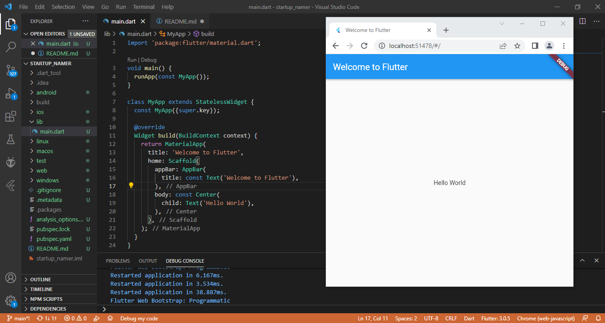
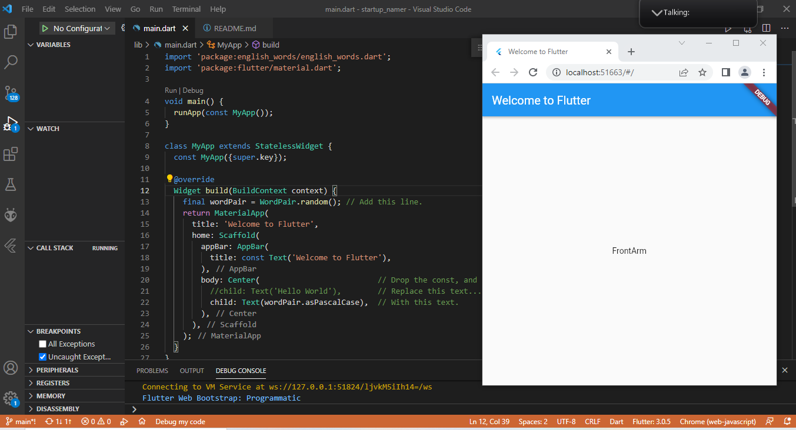
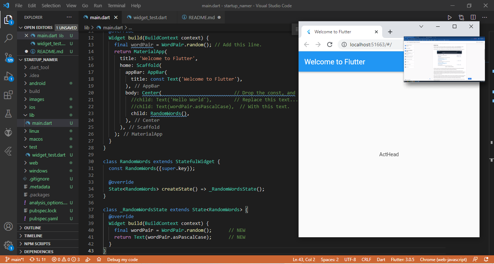
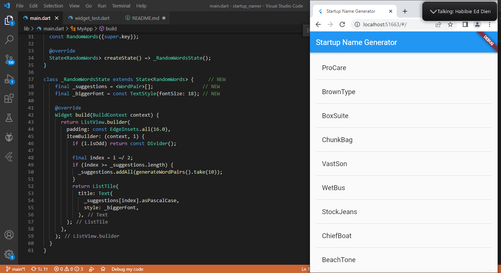

# 1. Create the starter Flutter app

Membuat project flutter baru dengan nama project **startup_namer**



# 2. Use an external package

Menambahkan package dependency dengan nama **english_words**

````
$ flutter pub add english_words
Resolving dependencies...
  async 2.8.1 (2.8.2 available)
  characters 1.1.0 (1.2.0 available)
+ english_words 4.0.0
  matcher 0.12.10 (0.12.11 available)
  test_api 0.4.2 (0.4.5 available)
  vector_math 2.1.0 (2.1.1 available)
Changed 1 dependency!
````

Kemudian menambahkan import package baru

````
import 'package:english_words/english_words.dart';  // Add this line.
import 'package:flutter/material.dart';
````



# 3. Add a stateful widget

Menerapkan stateful widget pada project flutter untuk mengakses package **english_words**



# 4. Create an infinite scrolling ListView

Membuat ListView yang dapat di scroll berdasarkan data yang di dapat dari package **english_words**

